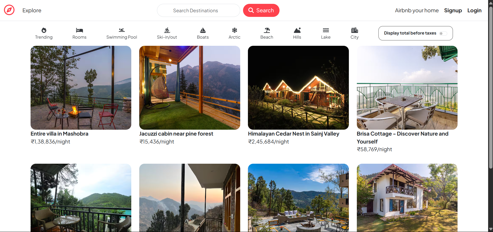

# Wanderlust

Wanderlust, is a full-stack web application built to demonstrate the integration of various technologies and frameworks for managing vacation rental listings. It serves as a practical example of how to build a feature-rich application using modern web development tools.

## Screenshot


## Features

### 1. **User Authentication**
   - Secure signup, login, and logout functionality.
   - Passwords are hashed for security using industry-standard practices.
   - Session-based authentication ensures a smooth user experience.

### 2. **Listings Management**
   - Users can create, edit, and delete their own property listings.
   - Listings include details such as title, description, price, location, and images.
   - Integrated with Cloudinary for image uploads and storage.

### 3. **Reviews and Ratings**
   - Users can leave reviews and ratings for properties they have visited.
   - Reviews include a star-based rating system and text feedback.
   - Property owners can view feedback to improve their offerings.

### 4. **Map Integration**
   - Interactive map powered by Mapbox API.
   - Users can view property locations directly on the map.
   - Geocoding ensures accurate location data for listings.

### 5. **Image Uploads**
   - Users can upload high-quality images for their property listings.
   - Images are stored securely using Cloudinary.
---

## Tech Stack

### Backend
- **Node.js**: JavaScript runtime for building the server-side application.
- **Express.js**: Web framework for handling routes and middleware.

### Frontend
- **EJS**: Template engine for rendering dynamic HTML pages.
- **Bootstrap**: CSS framework for responsive and modern UI design.

### Database
- **MongoDB**: NoSQL database for storing user, listing, and review data.

### Authentication
- **Passport.js**: Middleware for user authentication and session management.

### APIs and Services
- **Cloudinary**: For image uploads and storage.
- **Mapbox**: For geocoding and interactive map integration.

---
## Installation Guide

Follow these steps to set up and run the Wanderlust application on your local machine:

### Prerequisites
1. **Node.js**: Ensure you have Node.js installed. You can download it from [Node.js Official Website](https://nodejs.org/).
2. **MongoDB**: Install and run MongoDB. Refer to the [MongoDB Installation Guide](https://www.mongodb.com/docs/manual/installation/) for your operating system.
3. **Cloudinary Account**: Create a Cloudinary account and obtain your API credentials.
4. **Mapbox Account**: Sign up for Mapbox and get your API key.

### Steps
1. **Clone the Repository**
    ```bash
    git clone https://github.com/amanhaidry/Wanderlust.git
    cd Wanderlust
    ```

2. **Install Dependencies**
    ```bash
    npm install
    ```

3. **Set Up Environment Variables**
    - Create a `.env` file in the root directory.
    - Add the following variables:
      ```env
      CLOUD_NAME=your-cloud-name
      CLOUD_API_KEY=your-api-key
      CLOUD_API_SECRET=your-api-secret
      MAP_TOKEN=your-mapbox-token
      ATLASDB_URL=your-mongodb-uri
      SECRET=your-session-secret
      ```


4. **Start the Application**
    ```bash
    npm start
    ```

5. **Access the Application**
    - Open your browser and navigate to `http://localhost:8080`.

---

### Notes
- Ensure all required environment variables are correctly set up.
- For production deployment, additional configurations may be required.


## Live Demo

Check out the deployed application at [Wanderlust Live](https://wanderlust-1c5w.onrender.com/listings).

### Performance Note

- Please note that the application may load slowly due to being hosted on a free-tier deployment service.
